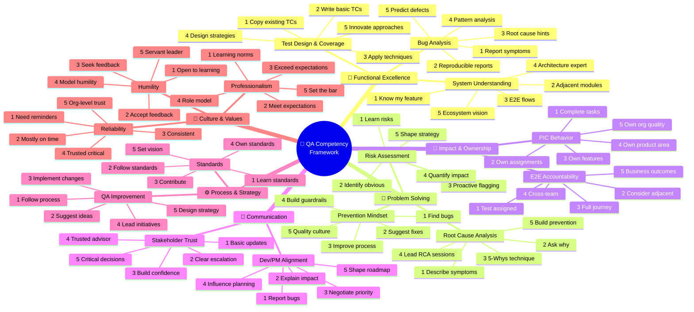

# QA Competency Framework - Mindmap

---

> **Created by:** Aditya Mirza Bahari  
> **Copyright:** © 2025 Aditya Mirza Bahari. All Rights Reserved.  
> **Version:** 1.0  
> **Last Updated:** January 2025

---

## Visual Diagram (Mermaid)

Copy this code into any Mermaid-compatible tool (Notion, Confluence, Miro, draw.io, etc.):



---

## Simple Text Mindmap

```
                                    ┌──────────────────────────────────────┐
                                    │     🎯 QA COMPETENCY FRAMEWORK       │
                                    │      Based on Dreyfus Model          │
                                    └───────────────┬──────────────────────┘
                                                    │
        ┌───────────────┬───────────────┬───────────┴───────────┬───────────────┬───────────────┐
        │               │               │                       │               │               │
        ▼               ▼               ▼                       ▼               ▼               ▼
   ┌─────────┐    ┌─────────┐    ┌─────────────┐          ┌─────────┐    ┌─────────┐    ┌─────────┐
   │   🔬    │    │   🧩    │    │     🎯      │          │   💬    │    │   ⚙️    │    │   💎    │
   │Functional│   │Problem  │    │  Impact &   │          │ Commun- │    │Process &│    │Culture &│
   │Excellence│   │Solving  │    │ Ownership   │          │ ication │    │Strategy │    │ Values  │
   └────┬────┘    └────┬────┘    └──────┬──────┘          └────┬────┘    └────┬────┘    └────┬────┘
        │              │               │                       │              │              │
   ┌────┴────┐    ┌────┴────┐    ┌─────┴─────┐            ┌────┴────┐    ┌────┴────┐    ┌────┴────┐
   │         │    │         │    │           │            │         │    │         │    │         │
   ▼         ▼    ▼         ▼    ▼           ▼            ▼         ▼    ▼         ▼    ▼         ▼
┌──────┐ ┌──────┐┌──────┐┌──────┐┌──────┐┌──────┐    ┌──────┐┌──────┐┌──────┐┌──────┐┌──────┐┌──────┐┌──────┐
│Test  │ │System││Root  ││Risk  ││PIC   ││E2E   │    │Dev/PM││Stake-││QA    ││Stand-││Prof- ││Relia-││Humi- │
│Design│ │Under-││Cause ││Assess││Behav-││Account│   │Align-││holder││Improv││ards  ││ession││bility││lity  │
│      │ │stand ││Analy-││ment  ││ior   ││ability│   │ment  ││Trust ││ement ││      ││alism ││      ││      │
└──────┘ └──────┘└──────┘└──────┘└──────┘└──────┘    └──────┘└──────┘└──────┘└──────┘└──────┘└──────┘└──────┘
   │         │       │       │       │       │           │       │       │       │       │       │       │
   │         │       │       │       │       │           │       │       │       │       │       │       │
   └─────────┴───────┴───────┴───────┴───────┴───────────┴───────┴───────┴───────┴───────┴───────┴───────┘
                                                    │
                                    ┌───────────────┴───────────────┐
                                    │        DREYFUS LEVELS         │
                                    ├───────────────────────────────┤
                                    │  1 ─ Novice                   │
                                    │  2 ─ Advanced Beginner        │
                                    │  3 ─ Competent                │
                                    │  4 ─ Proficient               │
                                    │  5 ─ Expert                   │
                                    └───────────────────────────────┘
```

---

## Competency Summary Table

| # | Bucket | Sub-Competencies | Key Focus |
|---|--------|------------------|-----------|
| 1 | 🔬 Functional Excellence | Test Design, System Understanding, Bug Analysis | **Technical mastery of testing craft** |
| 2 | 🧩 Problem Solving | Root Cause Analysis, Risk Assessment, Prevention Mindset | **Analytical thinking & proactive quality** |
| 3 | 🎯 Impact & Ownership | PIC Behavior, E2E Accountability | **Taking responsibility & driving outcomes** |
| 4 | 💬 Communication | Dev/PM Alignment, Stakeholder Trust | **Building relationships & influence** |
| 5 | ⚙️ Process & Strategy | QA Improvement, Standards | **Continuous improvement & best practices** |
| 6 | 💎 Culture & Values | Professionalism, Reliability, Humility | **Character & team contribution** |

---

## Dreyfus Levels at a Glance

| Level | Name | Characteristics | QA Example |
|-------|------|-----------------|------------|
| **1** | Novice | Follows rules, needs guidance | Executes existing test cases |
| **2** | Advanced Beginner | Recognizes patterns | Writes basic test cases independently |
| **3** | Competent | Plans, prioritizes, handles complexity | Owns feature quality end-to-end |
| **4** | Proficient | Sees big picture, intuitive decisions | Designs test strategies, mentors others |
| **5** | Expert | Innovates, shapes practices | Defines org-wide quality standards |

---

## Target Levels by Role

```
Role              │ Functional │ Problem │ Impact │ Comm │ Process │ Culture │
──────────────────┼────────────┼─────────┼────────┼──────┼─────────┼─────────┤
Junior QA         │     2      │    2    │   2    │  2   │    1    │    2    │
Mid QA            │     3      │    3    │   3    │  3   │    2    │    3    │
Senior QA         │     4      │    4    │   4    │  4   │    3    │    4    │
QA Lead           │     4      │    4    │   5    │  5   │    4    │    5    │
QA Manager        │     4      │    5    │   5    │  5   │    5    │    5    │
```

---

## Quick Stats

- **6** Competency Buckets
- **15** Sub-Competencies  
- **5** Dreyfus Levels
- **300+** "I Can..." Statements

---

## Files Available

| File | Purpose |
|------|---------|
| `QA_Competency_Tracker_Final.xlsx` | Full assessment workbook with team sheets |
| `QA_Competency_Framework.html` | Interactive visual presentation (open in browser) |
| `QA_Competency_Mindmap.md` | This file - diagrams for slides/docs |

---

*Press 'E' in the HTML file to expand all sections for printing/presenting*

---

## 📜 Copyright & License

```
╔═══════════════════════════════════════════════════════════════════════════╗
║                                                                           ║
║   QA COMPETENCY FRAMEWORK                                                 ║
║   Based on Dreyfus Model of Skill Acquisition                             ║
║                                                                           ║
║   Created by: Aditya Mirza Bahari                                         ║
║   Copyright © 2025 Aditya Mirza Bahari. All Rights Reserved.              ║
║                                                                           ║
║   This work is protected by copyright law. Unauthorized reproduction,     ║
║   distribution, or modification is prohibited without written consent     ║
║   from the copyright holder.                                              ║
║                                                                           ║
║   For licensing inquiries, please contact the author.                     ║
║                                                                           ║
╚═══════════════════════════════════════════════════════════════════════════╝
```

---

**Aditya Mirza Bahari** — Quality Assurance Professional

